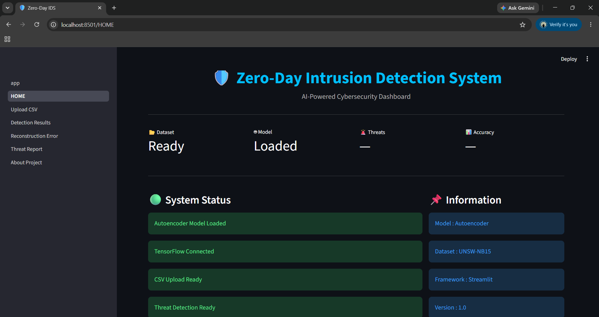
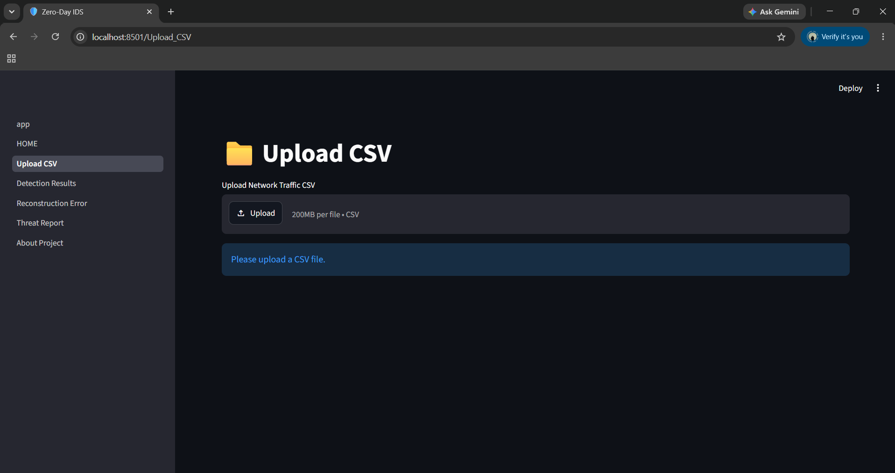
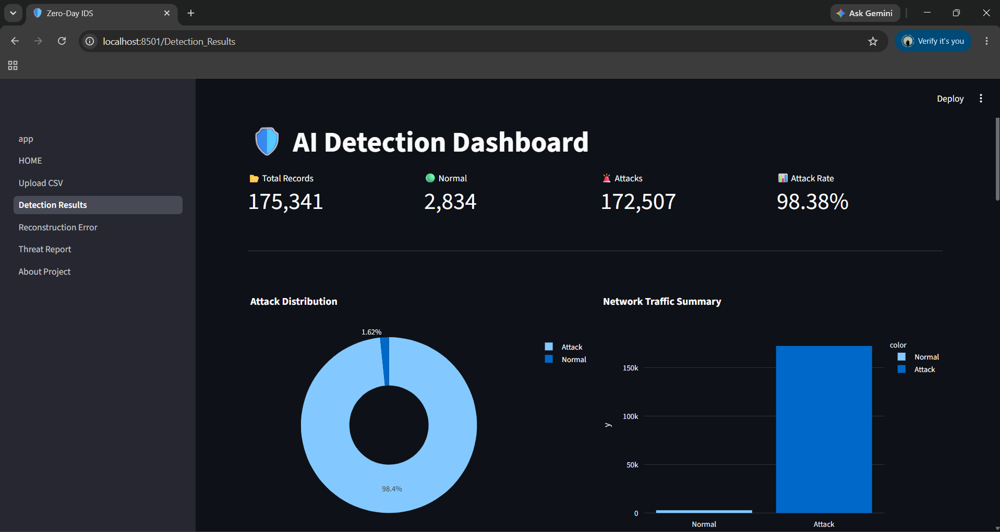
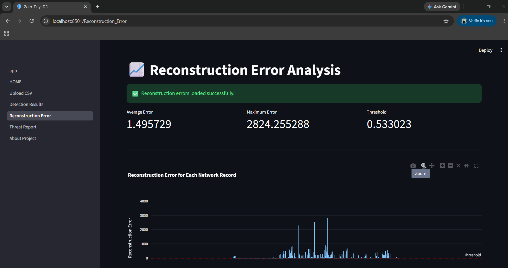
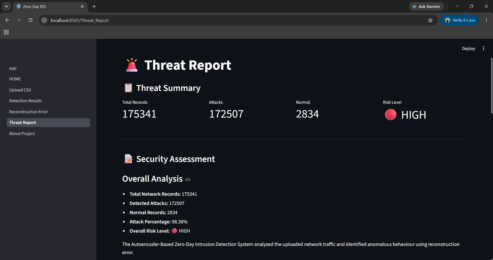

# 🛡️ Autoencoder-Based Zero-Day Intrusion Detection Framework

An AI-powered Intrusion Detection System (IDS) that detects **Zero-Day cyber attacks** using an **Autoencoder Deep Learning Model**. The system learns normal network traffic patterns and identifies anomalies based on reconstruction error.

---

##  Project Overview

Traditional Intrusion Detection Systems (IDS) rely on predefined attack signatures and often fail to detect unknown or zero-day attacks.

This project uses an **Autoencoder**, an unsupervised deep learning model, to learn normal network behavior. Any network traffic with a high reconstruction error is classified as a potential anomaly or zero-day attack.

The project also includes a **Streamlit Dashboard** for interactive analysis and visualization.

---

##  Features

-  Upload Network Traffic CSV
-  AI-Based Zero-Day Attack Detection
-  Detection Results Dashboard
-  Reconstruction Error Analysis
-  Threat Report Generation
-  Download Detection Results
-  Interactive Streamlit Dashboard

---

##  Technologies Used

- Python
- TensorFlow / Keras
- Streamlit
- Pandas
- NumPy
- Scikit-learn
- Plotly
- Joblib
- Git & GitHub

---

##  Dataset

**UNSW-NB15**

The UNSW-NB15 dataset contains both normal and malicious network traffic and is widely used for Intrusion Detection research.

- Training Data: ~37,000 Normal Records
- Testing Data: 175,341 Records
- Features: 42

---

##  Model Architecture

The project uses a **Symmetric Autoencoder**.

Input (42 Features)
⬇
Encoder
⬇
Bottleneck Layer
⬇
Decoder
⬇
Reconstructed Output

The model is trained only on **normal traffic**.

Network traffic with reconstruction error greater than the threshold is classified as an anomaly.

---

##  Dashboard Pages

 Home

- Project Overview
- System Status
- Workflow

 Upload CSV

- Upload Dataset
- Run AI Detection

 Detection Results

- Total Records
- Attack Count
- Normal Count
- Attack Rate
- Charts

 Reconstruction Error

- Error Distribution
- Reconstruction Error Graph

 Threat Report

- Risk Level
- Threat Summary
- Recommendations

 About Project

- Technologies
- Workflow
- Team Members
- Future Scope

---

##  Project Structure

```
ZeroDay-IDS/
│
├── app.py
├── README.md
├── requirements.txt
│
├── assets/
│
├── pages/
│   ├── Home.py
│   ├── Upload_CSV.py
│   ├── Detection_Results.py
│   ├── Reconstruction_Error.py
│   ├── Threat_Report.py
│   └── About_Project.py
│
├── models/
├── data/
├── reports/
├── utils/
│
└── Autoencoder-ZeroDay-IDS/
```

---

## Installation

Clone the repository

```bash
git clone https://github.com/Diya-012/ZeroDay-IDS.git
```

Open the project

```bash
cd ZeroDay-IDS
```

Create Virtual Environment

```bash
py -3.11 -m venv venv
```

Activate Virtual Environment

```bash
.\venv\Scripts\Activate
```

Install Dependencies

```bash
pip install -r requirements.txt
```

Run the Dashboard

```bash
streamlit run app.py
```

---

##  Dashboard

Add screenshots of:

- Home Dashboard

- Upload CSV

- Detection Results

- Reconstruction Error

- Threat Report



---

##  Team Members

**Member 1**
- Data Engineering & Preprocessing

**Member 2**
- AI/ML Model Development

**Member 3**
- Evaluation & Visualization

**Member 4**
- Dashboard Development & Deployment

---

## Future Scope

- Reduce False Positives
- Improve Threshold Optimization
- Variational Autoencoder
- LSTM Autoencoder
- Real-Time Network Monitoring
- Cloud Deployment
- SIEM Integration

---

## Conclusion

This project demonstrates how **Autoencoders** can successfully detect **Zero-Day cyber attacks** by learning only normal network behavior. The interactive Streamlit dashboard makes the system easy to use for real-world anomaly detection and analysis.

---

## License

This project is developed for academic and educational purposes.

---

If you like this project, consider giving it a star!